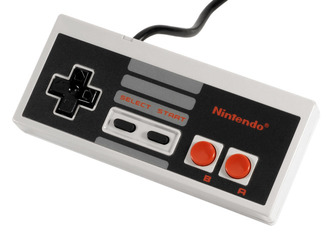
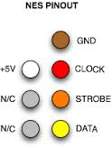

title = 'NES Controller Drive Walkthrough'

# NES Controller Driver Walkthrough



In Lab 3, I provided you with VHDL to drive an NES controller.  Since many of
you will write your own drivers for various hardware components for your final
project, I thought a walkthrough of the process I took might be helpful.

## Step 1 - Find the Datasheet

Any component you interface with will have a specific set of timing / voltage /
current requirements you'll have to meet for it to function properly.  The
first step of interfacing is to find them - typically listed in datasheets.

The NES doesn't have a standard datasheet I could find, so I resorted to
google.  This isn't uncommon - some devices will be difficult to get specs for,
so you need to be resourceful.  I googled things like:

- NES controller pinout
- NES controller timing diagram
- NES controller datasheet

I quickly found some good pictures.

  
**Controller Pinout**

  
**Controller Timing Diagram**

I also found a page with good information:
http://www.mit.edu/~tarvizo/nes-controller.html

The page gave me some more important info:

- Latch goes high for 12us
- 6us after latch, the clk signal begins
- The clock period is 12us with 50% duty cycle
- A should be read on the falling edge of the latch
- All other signal should be read on the falling edge of the clk

## Step 2 - Design the Interface

Designing the interface you want your library to have is crucial.  Think of
yourself as the programmer - what interface would be the easiest for you to
use?  For my NES driver, I thought it would be easy for each button to have its
own output signal that I could monitor.  Since the lab used a 25MHz
`pixel_clk`, I figured this would be a convenient `clk` input for me to use.

```vhdl
entity nes_controller is
    port (
        reset : in std_logic;
        clk : in std_logic;       -- 25MHz input clock
        data : in std_logic;      -- input from controller
        nes_clk : out std_logic;  -- generated by module - output to controller
        latch : out std_logic;    -- generated by module - output to controller
        a, b, sel, start, up, down, left, right : out std_logic
    );
end nes_controller;
```

## Step 3 - Generate Your Output Signals

Revise your code as necessary to make the outputs satisfy the specs.

**Code**

## Step 4 - Verify Them with the Logic Analyzer!

**Logic Analyzer Screenshot**

## Step 5 - Read in the Data

Read in the data.

Create a simple test program - mine lights up the LEDs based on which buttons
are pressed.

**Video**

## Step 6 - Refactor

How fast should I poll the NES controller?  I figure as quickly as possible to
make my signals the most accurate.  So I refactored my code to poll the
controller more quickly.

**Logic Analyzer Screenshot**
