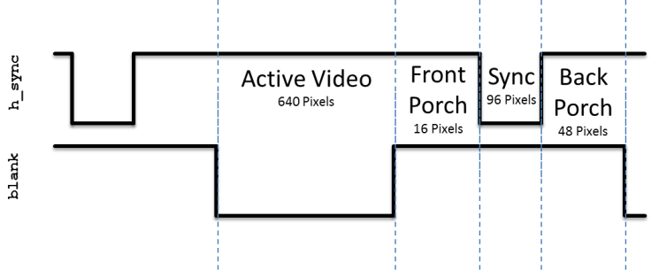
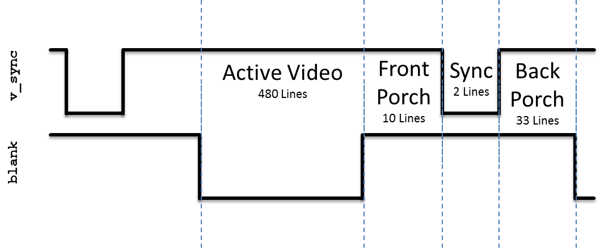
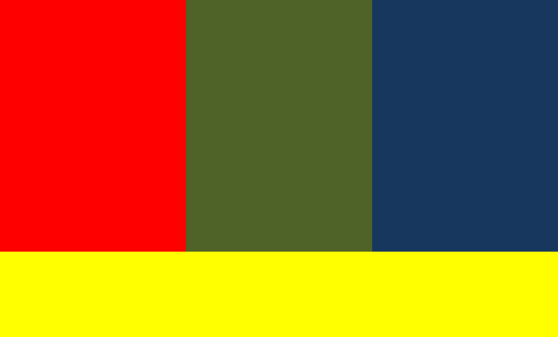

# Lab 1 - Video Synchronization

[Teaching Notes](notes.html)

## Lab Overview

In this lab, you will write a VGA controller in VHDL and implement it on your FPGA development board.  You will be provided a VGA-to-HDMI module that will automatically format your output for the HDMI output port on your development board.  Your video controller will be written using a modified version of the major-minor FSM methodology learned in the lecture. 

## VGA Overview

Video Graphics Array (VGA) is an interface protocol used to transmit analog video data to a screen.  The VGA protocol uses a scanning method to project an image on the screen.  Starting in the top-left of the screen, the monitor will progressively move from left to right, top to bottom to display each pixel.  The following signals must be sent to a VGA monitor in order to display an image.

1. `red`, `green`, `blue` - three separate analog voltage signals indicating the amount of each color to display in the current pixel.  These signals are sometimes abbreviated as RGB.
2. `h_sync` - Horizontal synchronization signal that tells the screen to start writing pixels to the next line
3. `v_sync` - Vertical synchronization signal that tells the screen that the current video frame is completed.  The screen then starts writing pixels to the top-left of the screen.

Both synchronization signals contain four unique states: `active_video`, `front_porch`, `sync_pulse`, and `back_porch`.  Incoming pixel data (through the RGB channels) is only displayed during the active_video state of the synchronization signals.

Internally, you will use a 25 MHz clock as your "pixel clock".  On the rising edge of this clock, when both the `h_sync` and `v_sync` signals are in the active_video state, you will place the RGB values you want the screen to display for that pixel.  During all other states, the RGB values must be "0".



**Figure 1**: The `h_sync` signal contains four states.  Pixel data is only displayed on the monitor during the active_video state.  During all other state, the RGB values must be "0".

The `v_sync` signal looks nearly identical to the `h_sync` signal, however it is significantly stretched out in time.  Where the `h_sync` signal was counted in terms of pixels (based on the pixel clock), the `v_sync` signal is counted based on iterations of the `h_sync` signal.  For example, in Figure 2, the `active_video` portion is active for 480 complete iterations of the `h_sync` signal.



**Figure 2**: The `v_sync` signal is similar to `h_sync`, but instead of counting based on the pixel clock, the states are based on the number of iterations of the `h_sync` signal.  Pixel data is only displayed on the monitor during the active_video state.  During all other state, the RGB values must be "0".

More details on the VGA protocol can be found at http://www-mtl.mit.edu/Courses/6.111/labkit/vga.shtml.  This link provides the exact numbers needed to generate the correct timing pulse signals for any VGA resolution.

## Prelab Assignment

On the first day of the lab, turn in a typed hard copy the following items:

1. Draw state-transition diagram for the `h_sync_gen` module which implements the timing diagram shown in Figure 1.  Just consider `count` to be an input to your FSM.
2. Sometimes you'll have to reset the count (state transition?).  Draw the conceptual diagram for `count_reg` and `count_next` signals based on inputs `state_reg` and `state_next`.
3. What is the Boolean expression for the completed signal?  Note that this signal is high for exactly one clock cycle - the last clock cycle in the back porch state.

## VGA Hardware Implementation

To successfully complete this lab, you will need to implement the modules shown in on the next-to-last page of this document.

- `h_sync_gen` and `v_sync_gen` modules
  - Generate the needed VGA synchronization signals: rgb pixel color vector, `h_sync`, and `v_sync`
  - Create simple `blank` signals to indicate when each module is not in the active video state.
  - Create row and column unsigned numbers to let the pixel generator know which pixel to write to the screen.  These should correspond to `count_reg` when in `active_video`, otherwise they should output 0.
  - Create a one-clock-cycle pulse, completed, during the last clock cycle of the back porch state.
  - _Hint_: The `h_completed` signal is used to increment the count in the `v_sync_gen` module.  You will use the `v_completed` signal in the next laboratory assignment.
- `vga_sync` module
  - Structurally connects the `h_sync_gen` and `v_sync_gen` modules
  - Generates a blank signal based on `v_blank` and `h_blank`.  This overall blank signal should be low when both `h_sync_gen` and `v_sync_gen` are in active video.
- `pixel_gen` module
  - Display a test pattern (see Figure 3) on the screen to aid you in testing the quality of your synchronization signals.
  - If any of the horizontal or vertical dividing lines are blurry or moving, you know that your signals are slightly out of sync.
- ece484_lab_video_tld is an example top-level module that the instructor used to implement this lab assignment

The `h_sync_gen` completed signal will pulse high on the last clock cycle of the `h_sync` signal to allow the `v_sync_gen` to count the number of lines completed.

The Atlys clock is 100 MHz.  Since our pixel clock will run at 25 MHz, we will use the same 25 MHz clock to synchronize all the elements within our circuit.  In addition, because of HDMI signal generation requirements, you must also generate a 125 MHz clock.

There are three code listings at the end of this document that will help you in this lab:

- Code Listing 1 - Template entity declarations for the modules you need to create in this lab.  By using these templates, your code will be plug-and-play with others so you can test/debug if an individual part does not work.  For example, once you finish your horizontal synchronization module, an instructor can plug your code into the solution, and check if your design works correctly in hardware.
- Code Listing 2 - Template for your top-level design.  This is provided to you to show how the DVI/HDMI modules are connected to your VGA module.
- Code Listing 3 - The constraints file that connects your top-level design ports to the required pins on the FPGA.



**Figure 3**: Your `pixel_gen` signal must create a test pattern similar to the one shown in the figure.  This test pattern will aid in testing the quality of your synchronization signals.

## A Functionality

- (10 pts) Change the test pattern or screen resolution in real-time based on switch configuration.  Based on switches on the Atlys board, allow the user to choose between four different test patterns.

## Bonus

- (5 pts) Create a moving "AF" logo on the screen.

## Programming the Atlys

Relevant Settings:

- Family: Spartan6
- Device: XC6SLX45
- Speed: -3

ISE will generate your bit file - you'll use Digilent's Adept software to program the board itself.

## Lab Hints

- Use generics to define the size of active video, sync pulses, etc.  This will be critical since you may need change the screen resolution in future labs.
- Use a package header to define global constants (e.g, size of active_video, sync_pulse; the states common to both FSMs, etc.)
- Use a look-ahead output buffer for your FSMs to prevent glitches
- **Watch out for inferred latches!** In the past, all hardware problems in this lab were caused by cadets ignoring this advice.
- If your simulation is acting "weird", i.e. signals are not changing when they should, be sure you have all the appropriate signals in the sensitivity list.
- Only write out RGB values when `blank` is low.  Otherwise you should put out "00000000" (black).  Failure to do this will prevent the monitor from correctly synchronizing with your signal.

## HDMI Overview

Generating DVID and HDMI signals is beyond the scope of this lab, but the following are excellent resources to learn the basics of these protocols:

1. Xilinx XAPP460 - Video Connectivity Using TMDS I/O in Spartan-3A FPGAs
2. Xilinx XAPP495 - Implementing a TMDS Video Interface in the Spartan-6 FPGA
3. Digital Visual Interface (DVI) Specification - Revision 1.0, 02 April 1999 - See pages 28 and 29 for TMDS encoding algorithm

## README Requirements

Your README must include the following:

- **Introduction** - Provide a brief overview of the problem.
- **Implementation** - Provide block-diagram of your solution and briefly describe how you implemented each the modules.  Include your state-transition diagram.  Commented VHDL code should be included.
- **Test/Debug** - Briefly describe the methods used to verify system functionality.  List the major problems you encountered and how you fixed them.  This should cover all the problems you encountered in the lab and how you fixed them.  It is highly encouraged that you present this section in bullet-format.  At a minimum, break each problem and solution into separate paragraphs.
- **Conclusion** - Explain what your learned from this lab and what changes you would recommend in future years to this lab or the lectures leading up to this lab.

## Free Code

```vhdl
entity h_sync_gen is
	port ( clk       : in  std_logic;
	       reset     : in  std_logic;
	       h_sync    : out std_logic;
	       blank     : out std_logic;
	       completed : out std_logic;
	       column    : out unsigned(10 downto 0)
     );
end h_sync_gen;

entity v_sync_gen is
	port ( clk         : in  std_logic;
	       reset       : in std_logic;
	       h_completed : in std_logic;
	       v_sync      : out std_logic;
	       blank       : out std_logic;
	       completed   : out std_logic;
	       row         : out unsigned(10 downto 0)
     );
end v_sync_gen;
entity vga_sync is
	port ( clk         : in  std_logic;
	       reset       : in  std_logic;
	       h_sync      : out std_logic;
	       v_sync      : out std_logic;
	       v_completed : out std_logic;
	       blank       : out std_logic;
	       row         : out unsigned(10 downto 0);
	       column      : out unsigned(10 downto 0)
     );
end vga_sync;

entity pixel_gen is
	port ( row      : in unsigned(10 downto 0);
	       column   : in unsigned(10 downto 0);
	       blank    : in std_logic;
	       r        : out std_logic_vector(7 downto 0);
	       g        : out std_logic_vector(7 downto 0);
	       b        : out std_logic_vector(7 downto 0));
end pixel_gen;

entity atlys_lab_video is
    port ( 
             clk   : in  std_logic; -- 100 MHz
             reset : in  std_logic;
             tmds  : out std_logic_vector(3 downto 0);
             tmdsb : out std_logic_vector(3 downto 0)
         );
end atlys_lab_video;
```

**Code Listing 1** - Entity templates for the lab to ensure consistency between student designs.

```vhdl
-- TODO: Include requied libraries and packages
--       Don't forget about `unisim` and its `vcomponents` package.
-- TODO: Entity declaration (as shown on previous page)

architecture your_last_name of atlys_lab_video is
    -- TODO: Signals, as needed
begin

    -- Clock divider - creates pixel clock from 100MHz clock
    inst_DCM_pixel: DCM
    generic map(
                   CLKFX_MULTIPLY => 2,
                   CLKFX_DIVIDE   => 8,
                   CLK_FEEDBACK   => "1X"
               )
    port map(
                clkin => clk,
                rst   => reset,
                clkfx => pixel_clk
            );

    -- Clock divider - creates HDMI serial output clock
    inst_DCM_serialize: DCM
    generic map(
                   CLKFX_MULTIPLY => 10, -- 5x speed of pixel clock
                   CLKFX_DIVIDE   => 8,
                   CLK_FEEDBACK   => "1X"
               )
    port map(
                clkin => clk,
                rst   => reset,
                clkfx => serialize_clk,
                clkfx180 => serialize_clk_n
            );

    -- TODO: VGA component instantiation
    -- TODO: Pixel generator component instantiation
    
    -- Convert VGA signals to HDMI (actually, DVID ... but close enough)
    inst_dvid: entity work.dvid
    port map(
                clk       => serialize_clk,
                clk_n     => serialize_clk_n, 
                clk_pixel => pixel_clk,
                red_p     => red,
                green_p   => green,
                blue_p    => blue,
                blank     => blank,
                hsync     => h_sync,
                vsync     => v_sync,
                -- outputs to TMDS drivers
                red_s     => red_s,
                green_s   => green_s,
                blue_s    => blue_s,
                clock_s   => clock_s
            );

    -- Output the HDMI data on differential signalling pins
    OBUFDS_blue  : OBUFDS port map
        ( O  => TMDS(0), OB => TMDSB(0), I  => blue_s  );
    OBUFDS_red   : OBUFDS port map
        ( O  => TMDS(1), OB => TMDSB(1), I  => green_s );
    OBUFDS_green : OBUFDS port map
        ( O  => TMDS(2), OB => TMDSB(2), I  => red_s   );
    OBUFDS_clock : OBUFDS port map
        ( O  => TMDS(3), OB => TMDSB(3), I  => clock_s );

end your_last_name;
```
**Code Listing 2** - Template for your top-level design.  You must place the correct code to replace the "TODO" comments.


```
VCCAUX = 3.3;

NET "clk" LOC = "L15" | PERIOD = 100 MHz;

NET "reset" LOC = "F5" | IOSTANDARD = LVCMOS33;

NET "TMDS(0)"  	LOC = "D8" | IOSTANDARD = TMDS_33 ; # Blue
NET "TMDSB(0)"  LOC = "C8" | IOSTANDARD = TMDS_33 ;
NET "TMDS(1)"  	LOC = "C7" | IOSTANDARD = TMDS_33 ; # Red
NET "TMDSB(1)"  LOC = "A7" | IOSTANDARD = TMDS_33 ;
NET "TMDS(2)"  	LOC = "B8" | IOSTANDARD = TMDS_33 ; # Green
NET "TMDSB(2)"  LOC = "A8" | IOSTANDARD = TMDS_33 ;
NET "TMDS(3)"  	LOC = "B6" | IOSTANDARD = TMDS_33 ; # Clock
NET "TMDSB(3)"  LOC = "A6" | IOSTANDARD = TMDS_33 ;
```
**Code Listing 3** -  Required UCF Contents

**Third-Party code you'll need:**

- [DVID Module](dvid.vhd)
- [TDMS_encoder Module](TDMS_encoder.vhd)


## Grading

| Item | Grade | Points | Out of | Date | Due |
|:-: | :-: | :-: | :-: | :-: |
| Prelab | **On-Time:** 0 ---- Check Minus ---- Check ---- Check Plus | | 10 | | BOC L9 |
| Required Functionality | **On-Time** ------------------------------------------------------------------ **Late:** 1Day ---- 2Days ---- 3Days ---- 4+Days| | 50 | | COB L11 |
| A Functionality | **On-Time** ------------------------------------------------------------------ **Late:** 1Day ---- 2Days ---- 3Days ---- 4+Days| | 10 | | COB L11 |
| Bonus Functionality | **On-Time** ------------------------------------------------------------------ **Late:** 1Day ---- 2Days ---- 3Days ---- 4+Days| | 5 | | COB L11 |
| Use of Git / Github | **On-Time:** 0 ---- Check Minus ---- Check ---- Check Plus ---- **Late:** 1Day ---- 2Days ---- 3Days ---- 4+Days| | 5 | | COB L12 |
| Code Style | **On-Time:** 0 ---- Check Minus ---- Check ---- Check Plus ---- **Late:** 1Day ---- 2Days ---- 3Days ---- 4+Days| | 5 | | COB L12 |
| README | **On-Time:** 0 ---- Check Minus ---- Check ---- Check Plus ---- **Late:** 1Day ---- 2Days ---- 3Days ---- 4+Days| | 20 | | COB L12 |
| **Total** | | | **100** | | |
