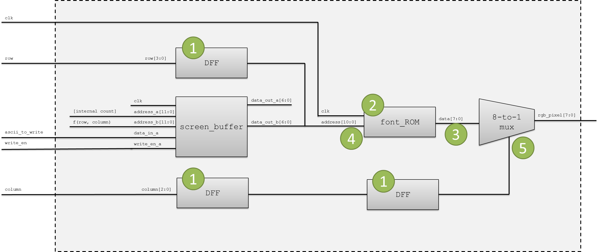

# Lab 3 - Font Controller

## Lab Overview

In the lab, you will develop a simple font controller for the VGA controller you previously created.  Your controller will allow a user to write a character to any location within a 30 character by 80 character grid on the screen.

## Font Controller Overview

In order to implement the font controller, you will need to create at below three modules.  Example VHDL entity declarations for these modules are provided on the second-to-last page of this document.

1. Font ROM - A "look-up table" that contains the 127 different characters that we are able to display on the screen.  An example 8x16 character is provided in Figure 1.  This module is provided for you on the course website.
2. Screen Character Buffer - 2400 (80 columns, 30 rows – based on a 640x480 screen resolution) character buffer that stores the character to display at each location on the screen.  The memory structure you will implement is shown in Figure 2.  To implement this module, you infer block RAM as shown in the XST User Guide.  The following definitions are helpful to interpret the terminology on Figure 3, i.e. how to structurally connect the screen buffer to the other signals in the character generator.
  1. `address_a`, `data_out_a`, `data_in` - used as a write port in the latter part of the lab when we will write new values to incrementing (internal_count) locations based on button presses
  2. `address_b`, `data_out_b` - used to read ASCII character in one of the 80 x 30 total memory locations in the RAM.  This is a continual process which is updated based on the current pixel’s row and column
  3. f(row, column) - a combinational statement that calculates the ASCII character we are returning.  (e.g., row = 8, col = 16, results in 80 returning).  This is very similar to 2D array math, but you I	gnore the lowest 3/4 bits for column/row.
3. Character Generation Controller - This module takes in the current VGA row/column and outputs one RGB pixel based on whether or not that pixel is part of a font character.  To simplify the logic needed, the fonts are 8x16 pixels.  Most of the structure and logic is given to you in Figure 3.
4. Top Level Design - Connects `character_gen`, `input_to_pulse`, `vga_sync`, and the DCM together.  You will also need to add registers to delay the VGA signals to account for the pipeline delays within the character generation controller.


**Figure 1**: Example font 8x16 pixel character that is stored in the font ROM.  For clarity, only the “1” values are shown in this diagram.  In the actual hardware implementation, all the blank memory bits are “0”s.


**Figure 2**: Screen character buffer memory addresses for the characters that are displayed on the screen.  Each memory address contains the 7-bit pseudo-ASCII value that is used to look up the pixel data in the font ROM.  You will need to generate these addresses based on the current row and column from the VGA controller.

## Prelab Assignment

On the first day of the lab, turn in a typed hard copy the following items: [Note: each number corresponds to a label in Figure 3]
1. What is the purpose of the registers?
2. What is the purpose of the font ROM?
3. What does data[7:0] represent?
4. In what order should row[3:0] and data_out_b[7:0] be concatenated?  Why?
5. What is which data[7:0] bit should be returned for each of the following column values:
  1. column[2:0] = “000”
  2. column[2:0] = “001”
  3. column[2:0] = “010”
  4. column[2:0] = “011”
  5. column[2:0] = “100”
  6. column[2:0] = “101”
  7. column[2:0] = “110”
  8. column[2:0] = “111”

Also, you must turn in the VHDL code and simulation results for your completed `input_to_pulse` module, as described in the next section.  Do not underestimate this task!  In the past, many students never were able to get a fully functional input_to_pulse module.

## Hardware Implementation

The core logic of your implementation will be contained within the `character_gen` module.  It takes in the current row/column and outputs the RGB value to the VGA screen.

For a given pixel row and column you can calculate the address needed to input to the character screen buffer.  The output of the screen buffer will be used to lookup that character in the font ROM.  The lower four bits of the row address determine which row of the font character to look up and display.  The lower three bits of the column data can be used to determine which column of the font character to display.  A graphical depiction of this process is available in Figure 3.

To test your character generation control module in hardware, you should use switches as input and a push button to tell the controller to write the switch ASCII character into the screen character buffer.  In order to make this work, you should create an `input_to_pulse` module that takes a button press and generates a logic high signal for exactly one clock cycle.  This module must also debounce the input.  The debounce feature is usually implemented by using a shift register to store the last n input values.  When the shift register contains all logic high values, then the output will pulse high for one clock cycle.  Use an FSM to keep track of which state the `input_to_pulse` module is in.  Note that you will need to shift the shift register about once every 1 ms, not once every clock cycle.

## Lab Hints

- In this lab you will be creating inferred block RAM.  Use the “Dual-Port RAM With Synchronous Read (Read Through) VHDL Coding Example” provided in the Xilinx XST User Guide (page 153) to help you.
  - The XST user guide also explains how to initialize the memory.
  - Check your synthesis output log to check if the XST synthesizer correctly inferred the RAM.
- Since the rgb_pixel signal is delayed two clock cycles, you will need to pipeline (i.e., add registers) to your other VGA signals in your top-level design.
- Make sure you use the correct IO standard in your constraints file.  All GPIO pins should have the following constraint added: IOSTANDARD = LVCMOS33.

## Extra Credit

Add additional features to this lab for extra credit.  Here are a few ideas, but you can come up with your own as well:

- Write a controller for a PS/2 keyboard and use that as your input rather than the switches and buttons.
- Modify the font controller to create larger fonts while still using the same font ROM.  To implement this, you will need to develop a module that "scales up" the font ROM.



**Figure 3**: Example internal diagram for the character_gen module.

```vhdl
entity input_to_pulse is
    port ( clk          : in std_logic;
           reset        : in std_logic;
           input        : in std_logic;
           pulse        : out std_logic
         );
end input_to_pulse;

entity font_rom is
    port(
           clk: in std_logic;
           addr: in std_logic_vector(10 downto 0);
           data: out std_logic_vector(7 downto 0)
         );
end font_rom;

entity char_screen_buffer is – Dual-port RAM template from synthesis guide (minor mods)
    port ( clk        : in std_logic;
           we         : in std_logic;                     -- write enable
           address_a  : in std_logic_vector(11 downto 0); -- write address, primary port
           address_b  : in std_logic_vector(11 downto 0); -- dual read address
           data_in    : in std_logic_vector(7 downto 0);  -- data input
           data_out_a : out std_logic_vector(7 downto 0); -- primary data output
           data_out_b : out std_logic_vector(7 downto 0)  -- dual output port
         );
end char_screen_buffer;

entity character_gen is
    port ( clk            : in std_logic;
           blank          : in std_logic;
           row            : in std_logic_vector(10 downto 0);
           column         : in std_logic_vector(10 downto 0);
           ascii_to_write : in std_logic_vector(7 downto 0);
           write_en       : in std_logic;
           rgb_pixel      : out std_logic_vector(7 downto 0)
         );
end character_gen;

entity atlys_lab_font_controller is
    port ( 
             clk    : in  std_logic; -- 100 MHz
             reset  : in  std_logic;
             start  : in  std_logic;
             switch : in  std_logic_vector(7 downto 0);
             led    : out std_logic_vector(7 downto 0);
             tmds   : out std_logic_vector(3 downto 0);
             tmdsb  : out std_logic_vector(3 downto 0)
         );
end atlys_lab_font_controller;
```

**Code Listing 1** - Entity templates for the lab to ensure consistency between student designs.


Font Controller Cut Sheet
Name: _________________  Instructor: ________________  Section: ________
Number of hours spent on this lab: _________________ (no points associated with this unless you leave it blank)
Suggestions to improve this lab in future years: (use blank space below)
