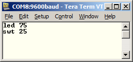
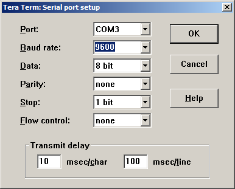

# Lab 4 - Remote Terminal

## Lab Overview

In this lab, you will interface a number of peripherals to a simple PicoBlaze processor.  By using a USB-to-UART bridge, you will create a program that can take a command written over your computer’s serial port (i.e., remote terminal) and read or write to any one of your input or output peripherals.  Specifically, you will need to control the following on your development board: LEDs and switches.  All characters typed by the user must be echoed.

In the second part of the lab, you will implement the same logic, but use the MicroBlaze processor instead.  You will also add a VGA output peripheral. 

## System Overview

Your software will read in three digit commands along with optional parameters.  The list of commands you must implement is provided in Table 1.  The commands are executed by your code as soon as the user finished typing (i.e., they do not have to press “Enter”).

| Command | Description |
| :-: | :-: |
| `led ##` | Write the hex value "##" to the LEDs |
| `swt` | Read in the current switch value and write to the terminal as a two hex values |

**Table 1**: List of commands that must be implemented in this laboratory assignment.  See Figure 1 for an example terminal session.



**Figure 1**: Sample terminal session that shows all the features needed for this lab.  This session set the LEDs to 0x75 and shows that the switches are currently set to the value 0x25.

## Prelab Assignment

Create a PicoBlaze design that meets the following requirements:

1. Defines the following ports:
  1. Port `0xAF` - Read switch inputs
  2. Port `0x07` - Read push button inputs
  3. Port `0x07` - write button values to upper-four LEDs, and lower-four switch values to the lower-four LEDs.
2. Constantly read in the push buttons and lower-four bits of the switches and writes those values out to the LEDs.

Turn in a hard copy of your software and VHDL code along with simulation screenshots to demonstrate your design works correctly.

You should use the openPICIDE software to write and simulate your assembly code, as shown in class.  Make sure you have the following settings:

- Spartan 6 FPGA
- Memory Bank Size of 1024 instructions
- Select the VHDL PicoBlaze ROM template from the course website as your "VHDL Template."

## PicoBlaze Implementation

You must design your hardware and software implementation for this lab.

## MicroBlaze Implementation

With MicroBlaze, recreate the same functionality as in the first part of this lab.  However, you must also add a vga command that allows the user to specify the background color to send to the VGA monitor.

_Note_: Never connect any of your ports to the `GCLK` signal.   Or you will get a PAR error and your design will not work correctly.

## Lab Hints

- Define your ports as constants in your PicoBlaze and VHDL code.  This will make your code much more readable.
- Tera Term is freeware software that can communicate over your computer’s serial ports.   You can download it from the course website.
  - Configure the speed to Tera Term by using the “Setup” → “Serial Port” menu option
  - Select the USB-UART serial port (check your computer Device Manager if you are unsure of the port).
  - The baud rate should be 9600 for this lab



**Figure 2** - Example serial configuration for Tera Term.

- Note: Your "serial in" - i.e., where the computer is sending you data for the FPGA to read - pin is A16.  Look at the datasheet to find the "serial out" pin location.
- To avoid crossing clock domains, all your synchronous elements should be based on a 25 MHz clock.
- Take advantage of the simulator in the openPICIDE.
- Build converter modules (e.g., `ascii_to_nibble`, `nibble_to_ascii`, etc.).
- Use the Xilinx-provided (available on the course website) `uart_tx6` and
  `uart_rx6` modules rather than writing your own UART controller.
  - The reference manual for these modules is available on the course website.
  - You must create a module, `clk_to_baud`, that generates an enable signal that pulses high for one clock cycle.  Based on the time between these pulses, your baud rate is 16 times that value.  For example, if you have an enable pulse once every 1 ms, your baud rate is (1 / (16 * 1ms)) = 62,500 baud.
  - You will probably need to manually create the `write_buffer` signal rather
    than using PicoBlaze’s `write_strobe` signal due to timing issues.  The
same applies for the `write_strobe` signal.
- Start small and work larger.  Here is a sample approach to this problem:
  1. Ensure the UART configuration is correct on your FPGA and drivers are
installed on your computer.  Do a hardware loopback on the UART module
(`serial_out <= serial_in;`).
  2. Write your clk_to_baud module.  A good example is provided in the Xilinx UART manual on the course website.  Simulate this design to ensure it runs correctly.
  3. Connect the `uart_tx6` and `uart_rx6` modules to a simple PicoBlaze program that takes the serial input (if available) and writes it to the serial output.
  4. Expand your PicoBlaze code to process the `swt` command.
  5. Expand your PicoBlaze code to process the `led ##` command.

## Extra Credit

Add additional features to this lab for extra credit.  Here are a few ideas, but you can come up with your own as well:

- Add a command-line prompt similar to what you see when you are using cmd.exe in windows.
- Add error checking to the input.  Display an error message if the command is not valid.
- Add another unique (i.e., non-trivial – so just using the push-buttons as another input would not count) peripheral to your design.  For example, you could use the character generator module created earlier in the course. Another, perhaps easier, option is to add the seven-segment displays an output.

```vhdl
entity ascii_to_nibble is
    port ( ascii : in std_logic_vector(7 downto 0);
           nibble  : out std_logic_vector(3 downto 0)
         );
end ascii_to_nibble;

entity nibble_to_ascii is
    port ( nibble : in std_logic_vector(3 downto 0);
           ascii  : out std_logic_vector(7 downto 0)
         );
end nibble_to_ascii;

entity clk_to_baud is
    port ( clk         : in std_logic;  -- 25 MHz
           reset       : in std_logic;
           baud_16x_en : out std_logic -- 16*9.6 kHz
        );
end clk_to_baud;

entity atlys_remote_terminal_pb is
    port (
             clk        : in  std_logic;
             reset      : in  std_logic;
             serial_in  : in  std_logic;
             serial_out : out std_logic;
             switch     : in  std_logic_vector(7 downto 0);
             led        : out std_logic_vector(7 downto 0)
         );
end atlys_remote_terminal_pb;
```

**Code Listing 1** - Entity templates for the lab to ensure consistency between student designs.

## Grading

| Item | Grade | Points | Out of | Date | Due |
|:-: | :-: | :-: | :-: | :-: |
| Prelab | **On-Time:** 0 ---- Check Minus ---- Check ---- Check Plus | | 10 | | BOC L23 |
| Required Functionality (PicoBlaze) | **On-Time**------------------------------------------------------------------**Late:** 1Day ---- 2Days ---- 3Days ---- 4+Days | | 40 | | COB L24 |
| Required Functionality (MicroBlaze) | **On-Time** ------------------------------------------------------------------ **Late:** 1Day ---- 2Days ---- 3Days ---- 4+Days| | 40 | | COB L28 |
| A Functionality (MicroBlaze) | **On-Time** ------------------------------------------------------------------ **Late:** 1Day ---- 2Days ---- 3Days ---- 4+Days| | 10 | | COB L28 |
| Use of Git / Github | **On-Time:** 0 ---- Check Minus ---- Check ---- Check Plus ---- **Late:** 1Day ---- 2Days ---- 3Days ---- 4+Days| | 5 | | COB L29 |
| Code Style | **On-Time:** 0 ---- Check Minus ---- Check ---- Check Plus ---- **Late:** 1Day ---- 2Days ---- 3Days ---- 4+Days| | 5 | | COB L29 |
| README | **On-Time:** 0 ---- Check Minus ---- Check ---- Check Plus ---- **Late:** 1Day ---- 2Days ---- 3Days ---- 4+Days| | 20 | | COB L29 |
| **Total** | | | **100** | | |
