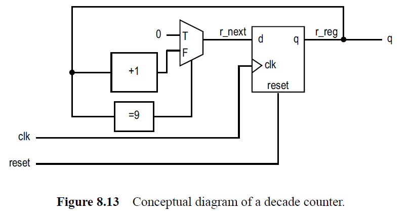
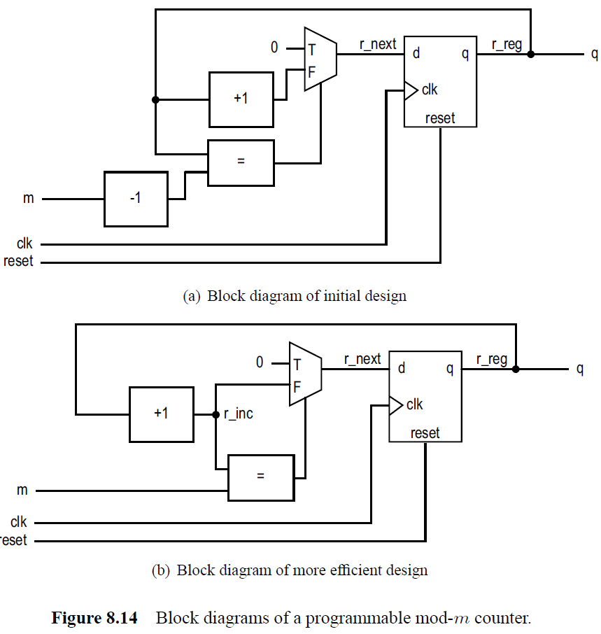

# L29 Homework

- Consider the block diagram below.  Let `Tcq` and `Tsetup` of the DFF be `1ns` and `0.5ns`, and the propagation delays of the incrementor, comparator, and multiplexer be `5ns`, `3ns`, and `0.75ns` respectively.  Assume that no further optimization will be performed during synthesis.  Determine the maximal clock rate.

- Consider the two block diagrams (below) of the mod-m counter.  Let `Tcq` and `Tsetup` of the DFF be `1ns` and `0.5ns`, and the propagation delays of the incrementor, comparator, and multiplexer be `5ns`, `3ns`, and `0.75ns` respectively.  Assume that no further optimization will be performed during synthesis.  Determine the maximal clock rates of the two configurations.

## Turn-In Requirements

1. Answers to the above questions
2. Simulation screenshots and source code where appropriate.
