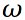

# L30 Homework

- Assume that a sequential system with an ideal clock signal can operate at a maximal clock rate of `100 MHz`.  If the physical clock distribution network introduces a `1.5ns` clock skew, what is the new maximal clock rate?
- Consider a DFF with  and .
  - If we improve the DFF by reducing  by 10%, discuss the effect on MTBF.
  - If we improve the DFF by reducing  by 10%, discuss the effect on MTBF.
- A two-FF synchronizer is shown in the below diagram.  Determine the new MTBF for below scenarios assuming the following parameters:

  - The placement and routing process adds a `2.5ns` wiring delay.
  - The system clock rate is decreased by 10%.
  - The setup time of the DFF is reduced by 10%.
  - The  of the DFF is reduced by 10%.

## Turn-In Requirements

1. Answers to the above questions
2. Simulation screenshots and source code where appropriate.
